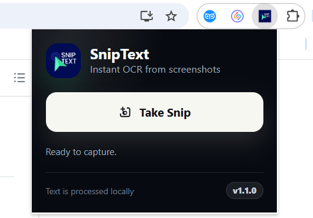
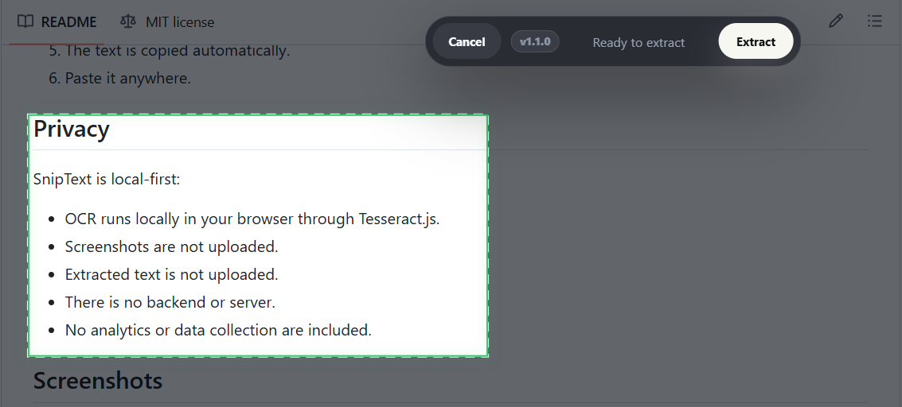
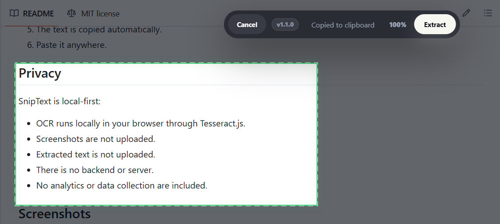

# SnipText - Instant OCR Chrome Extension

SnipText is a lightweight Chrome extension that lets you take a screenshot snip from the current browser tab, extract text with local OCR, and automatically copy the result to your clipboard.

It is designed to feel fast: click, snip, extract, paste.

## Features

- Screenshot the current browser tab
- Select and crop the area containing text
- Extract text with OCR
- Auto-copy extracted text to the clipboard
- Local processing only
- No APIs
- No uploads
- Fast browser-native workflow

## Tech Stack

- JavaScript
- Chrome Extension Manifest V3
- Tesseract.js
- Canvas API

## Installation

1. Download or clone this repository.
2. Open Chrome and go to `chrome://extensions`.
3. Enable `Developer mode` in the top-right corner.
4. Click `Load unpacked`.
5. Select the project folder.

## Usage

1. Click the SnipText extension icon.
2. Click `Take Snip`.
3. Drag to select the area containing text.
4. Click `Extract`.
5. The text is copied automatically.
6. Paste it anywhere.

> **Note:** SnipText currently works best with clear, readable printed text. Handwritten text is not supported reliably yet.

## Privacy

SnipText is local-first:

- OCR runs locally in your browser through Tesseract.js.
- Screenshots are not uploaded.
- Extracted text is not uploaded.
- There is no backend or server.
- No analytics or data collection are included.

## Screenshots

### Popup

### Crop UI

### Success Toast

## Future Improvements

- Better OCR formatting
- Multi-language support
- Desktop capture
- Smart code detection

## License

MIT License. See [LICENSE](LICENSE).
